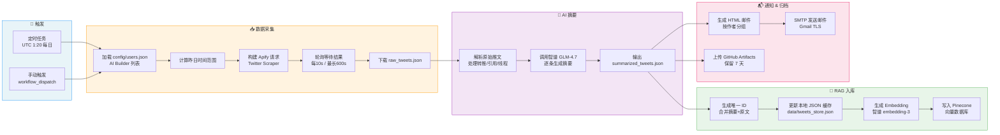
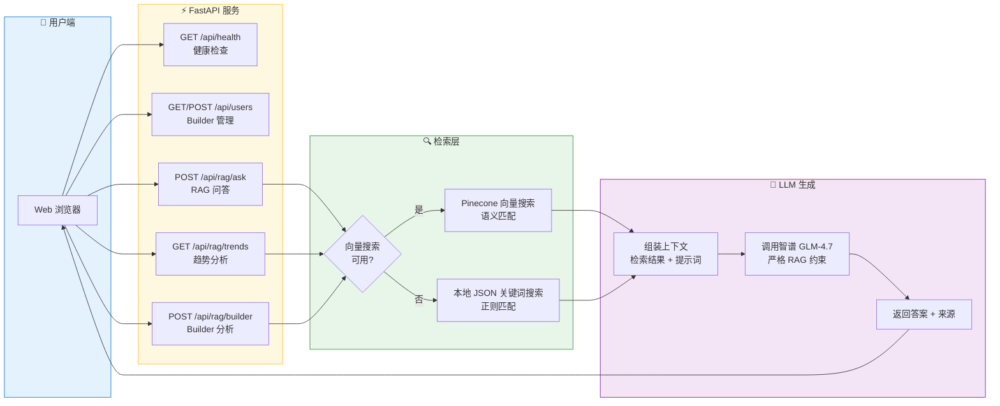
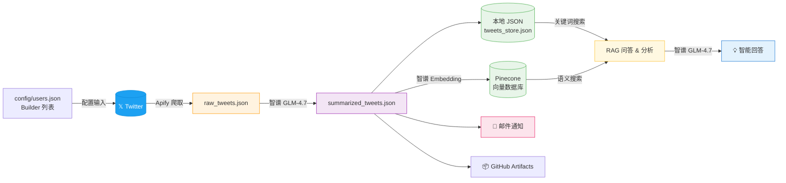

# AI Builder Daily Digest - 工作流程图

## 主工作流（每日自动执行）

## Web 应用服务流程

## 数据流全景

## 技术栈

| 层级 | 技术 |
|------|------|
| 编排调度 | GitHub Actions (Cron + Manual) |
| 数据采集 | Apify Twitter Scraper |
| AI 模型 | 智谱 GLM-4.7 + embedding-3 |
| 向量数据库 | Pinecone |
| Web 框架 | FastAPI + Uvicorn |
| 部署平台 | Render.com |
| 邮件通知 | SMTP (Gmail) |
